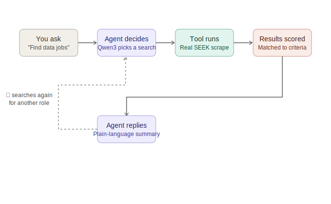

# Your Next Role Agent

A local AI agent that searches SEEK New Zealand for jobs matching personal criteria, reasons about fit using a locally-run LLM, and reports back in plain language — built as a hands-on project to learn Python and applied AI development together.

## What this demonstrates

This isn't a wrapper around an API call. It's a working agent: a local LLM (Qwen3, via Ollama) decides when and what to search for, calls a real web scraper as a tool, evaluates results against personal criteria, and can loop back to search again before giving a final answer — all running entirely on a local machine, no cloud LLM, no API keys.



The project also includes a fully scripted batch pipeline (the earlier, non-conversational version), persistent memory so re-running a search never shows duplicate listings, and a two-stage scraping strategy that filters out clearly senior roles before spending time fetching full job descriptions.

## Features

- Conversational AI agent with tool calling — ask in plain language, the agent decides how to search
- Playwright-based scraper for SEEK NZ, handling JavaScript-rendered listings
- Date-filtered, deduplicated search results
- Two-stage description scraping: skips fetching full descriptions for clearly senior/lead/manager roles, and extracts just the "About you" / "What you'll bring" section when present, falling back to the full description otherwise
- Consistent scoring logic shared between the chat agent and the batch pipeline, so both report identical scores and recommendations for the same job
- SQLite-backed memory — jobs already seen are never shown again, across sessions
- A batch-mode entry point for a single, scripted run with a saved JSON report

## Requirements

- Python 3.11+
- [Ollama](https://ollama.com) with `qwen3` pulled

## Setup

```bash
# 1. Create and activate virtual environment
python -m venv venv
venv\Scripts\activate        # Windows
# source venv/bin/activate   # macOS/Linux

# 2. Install dependencies
pip install -r requirements.txt
playwright install chromium

# 3. Start Ollama (in a separate terminal, if not already running)
ollama serve

# 4. Run the conversational agent
python main.py

# Or run the original one-shot batch pipeline
python batch_search.py
```

## Configuration

Edit `app/criteria.py` to set your:
- Target roles
- Location preferences (supports multiple locations)
- Skills and experience level
- Salary expectations
- Dealbreakers

## Usage

**Conversational mode** (`main.py`) — chat naturally:
```
You: find me data analyst jobs in Christchurch
You: now check Auckland too
You: stats     ← shows total jobs seen across all sessions
You: clear     ← resets the conversation, job memory is untouched
```

**Batch mode** (`batch_search.py`) — runs a fixed search across all roles in `criteria.py`, scores every result, prints a ranked summary, and saves a timestamped JSON report to `output/`.

## Project structure

```
next_role_ai/
├── main.py              # Conversational agent entry point
├── batch_search.py      # Scripted batch pipeline entry point
├── requirements.txt
├── assets/
│   ├── agent_flow.svg
│   └── agent_architecture.svg
├── app/
│   ├── criteria.py      # Your job search criteria
│   ├── scraper.py       # Playwright SEEK scraper + description extraction
│   ├── ollama_client.py # Qwen3 via Ollama API, with tool-calling support
│   ├── agent.py          # Tool definition + agent reasoning loop
│   ├── matcher.py       # Scoring pipeline + prompts
│   └── memory.py        # SQLite-backed job deduplication
├── poc/                 # Early Playwright proof-of-concept scripts
└── output/              # Timestamped batch result JSONs (gitignored)
```

## How it works

1. The user asks a question, in chat or via the fixed batch criteria
2. Qwen3 decides which role and location to search for, and calls the `search_seek` tool
3. Playwright opens SEEK, runs the search, and filters out titles with obvious seniority keywords before visiting individual job pages
4. For qualifying jobs, the scraper fetches a requirements snippet from the job description
5. Each new (previously unseen) job is scored against the candidate's criteria using a structured prompt
6. The agent presents the results, prioritising strong matches and remaining honest about weak ones

## Architecture



Two entry points (`main.py` for conversation, `batch_search.py` for a single scripted run) both call into the same `app/` package, so the chat agent and the batch pipeline always produce identical scores for the same job — `agent.py` calls `matcher.py`'s scoring function directly rather than re-judging results itself. `scraper.py` is the only module that talks to SEEK; `ollama_client.py` is the only module that talks to Ollama. `memory.py` and `criteria.py` are shared state and configuration, used by whichever entry point is running.

